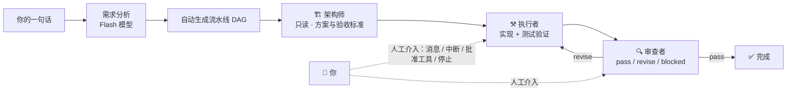

# 🧭 多智能体管家 · Multi-Agent Orchestrator

> **说一句话，剩下的交给管家。**
>
> 一个把「**描述任务 → 自动编排 → 多 Agent 协作执行 → 自动审查 → 迭代收敛**」串成完整流水线的
> **跨 Agent 协调编排控制台**：架构师负责想、执行者负责做、审查者负责把关，中途你可以随时插手。


---

## ✨ 为什么你需要它

| 单 Agent 干活 | 本方案（多 Agent 编排） |
|---|---|
| 一个模型从头干到尾，贵且容易跑偏 | 按角色分工：**规划用强模型、执行用便宜/免费模型、审查用轻量模型**，按节点路由 |
| 改 10 个文件的任务容易"做着做着忘了目标" | 架构师先定方案和验收标准，执行者照着做，审查者对表验收 |
| 出错了只能看一堆日志 | 审查者给出 **pass / revise / blocked** 结论 + 修改清单，自动迭代到通过 |
| 想插句话打断它？很难 | **随时人工介入**：发消息、打断、批准/拒绝工具、停止、恢复 |
| 换个电脑环境就废了 | **一键自检**：纯程序化探测本机可用的 Agent 与模型，自动适配（不烧 AI） |

---

## 🚀 快速开始（小白版，约 3 分钟）

### 前置条件（一次性）
| 依赖 | 说明 |
|---|---|
| **Go 1.25+** | 构建控制台本体：https://go.dev/dl/ |
| **DeepSeek API Key** | 规划/分析主力模型：`$env:DEEPSEEK_API_KEY = "sk-..."`（永不进仓库） |

> 其他执行器（codex / mimo / claude / opencode / dsh）**可选**：装了哪个，控制台就能用哪个；
> 一个都没装也能跑（默认走 DeepSeek 官方）。

### 第 1 步：启动

```powershell
git clone https://github.com/MRreeeg/multi_agent_orchestrator.git
cd multi_agent_orchestrator
.\scripts\start-orchestrator.ps1        # 自动编译并打开 http://127.0.0.1:8788/orchestrator
```

> 想要原生桌面应用？双击 `scripts\start-desktop.bat`（WebView2 独立窗口，带图标、记住窗口位置）。

### 第 2 步：说一句话

在首页输入框输入，例如：

> **"实现一个端口范围解析函数，支持单端口/连续范围/逗号组合与边界错误场景，含表格驱动测试，仅标准库"**

点「✨ 生成编排」——它会把这句话自动拆成 **架构师 → 执行者 → 审查者** 三个节点和它们的数据流。


### 第 3 步：一键执行，随时插手

点「▶ 执行」，运行看板实时显示每个 Agent 在做什么、进行到第几轮；审查者给出决策卡；
**随时可以**：打开 Runtime Console 给某个 Agent 发消息/打断、批准或拒绝工具请求、停止本轮、恢复。


---

## 🧠 它是怎么工作的



- **Loop 是运行时状态机**：画布上只有一组基础节点，迭代由 Orchestrator 控制（`fixed` 精确 N 轮 / `review_decides` 审查决定）。
- **多执行器自由混用**：每个节点可选执行器（reasonix / mimo / codex / claude / opencode / dsh）与模型，互不干扰。
- **客制化 Agent**：DSH 客制化预设（前端分析师·管家 / 架构师 / 执行者 / 审查者）可直接选作节点，卡片上标注「客制化 Agent」还是「Prompt 式」。

### 💰 省钱的核心思路

> **规划用贵的，执行用便宜的，审查用免费的。**

控制台内置模型选择原则（成本优先），你也可以手动指定。常见组合：

| 角色 | 推荐执行器 / 模型 | 成本 |
|---|---|---|
| 架构师 | deepseek-pro（reasonix） | 中等 |
| 执行者 | `mimo-v2.5`（mimo）或 `opencode/deepseek-v4-flash-free`（opencode） | **低 / 免费** |
| 审查者 | `deepseek-v4-flash`（dsh 官方直连）或免费模型 | 低 |


---

## 🔍 自检：换台电脑也能直接用

控制台顶部「一键自检」面板：

- **程序化探测**本机安装的每个执行器（跑 `mimo models` / `opencode models` / 读 codex/claude/dsh 配置），
  列出**这台电脑真实可用**的 Agent 与模型——不同供应商、不同电脑，结果不同，**全程不调用 AI**；
- 首次打开自动完成初始化探测，节点配置与分析入口的下拉会按探测结果适配；
- Skill 库（支持搜索 + 展开/收起）、客制化 DSH Agent（自动导入 `$DSH_HOME/.agent-presets`）、
  执行器二进制可用性一屏看完。


---

## 🛠 功能一览

| 功能 | 说明 |
|---|---|
| 🗣 一句话编排 | 需求分析自动生成 DAG（串行/并行/汇聚），支持 Loop 语义 |
| 🏗 三角色协作 | 架构师（只读规划）/ 执行者（实现+验证）/ 审查者（决策 JSON） |
| 🔄 Loop 状态机 | `fixed` 固定轮数 / `review_decides` 审查决定，迭代记录可审计 |
| 🔌 6 种执行器 | reasonix / mimo / codex / claude / opencode / dsh（DeepSeek Harness） |
| 🧭 模型路由 | deepseek 官方直连 / CCSwitch 中转 / 每节点独立模型 |
| 🤖 DSH 客制化 Agent | 前端分析师·管家等预设，headless 节点一键选用 |
| 💬 人工介入 | Runtime Console 发消息/打断、权限批准卡片、停止/恢复 Run |
| 📊 运行看板 | 实时节点状态、轮次、输出摘要、审查决策卡、AI 进展分析 |
| 🔍 程序化自检 | 不烧 AI 的机器能力探测，跨电脑即插即用 |
| 📦 桌面应用 | WebView2 原生窗口，可选浏览器模式 |
| 🧩 共用 Skill | DSH 直接复用 codex/mimo 已安装的 skill，不重复下载 |

---

## 📚 文档索引

- `MULTI_AGENT_README.md` — 多 Agent 编排完整说明
- `NEW_AGENT_QUICKSTART.zh-CN.md` — 新执行器/新模型快速接入（10 个接入点）
- `docs/deepseek-harness/` — DSH 执行器接入、客制化 Agent 打包与跨电脑复用
- `docs/调试记录.md` — 调试与修复记录（含大量踩坑经验）

---

## ❓ 常见问题

**Q：会不会很烧钱？**
A：默认按"成本优先"原则选模型，执行段可以切到免费模型；每个节点可独立指定模型，Token 统计实时可见。

**Q：中途能插手吗？**
A：能。执行期间可随时给 Agent 发消息、打断当前轮、批准/拒绝工具请求、停止或恢复 Run，插手的记录不会污染 Loop 历史。

**Q：一定要装 6 个执行器吗？**
A：不用。只装 DeepSeek 凭据即可跑通全流程；每多装一个执行器，节点下拉就多一种选择（自检自动发现）。

**Q：API Key 会进仓库吗？**
A：不会。Key 只走环境变量或本机凭据文件，仓库里没有真实密钥（有扫描保障）。

---

## 🔒 安全与边界

- 审批策略：编排节点默认 `never`（headless 无人应答），只读角色（架构师/审查者）走只读沙箱；
- 浏览器只连控制台自身的 HTTP/SSE，不直连任何 Provider 端点；
- 自定义 DSH 预设与 shell 同等信任，只在你自己电脑上安装。

## 📄 License

MIT（见 `LICENSE`）。

---

> ⭐ 如果这个项目帮到了你，欢迎 Star；遇到问题请开 Issue，附上「自检面板截图」最快定位。
