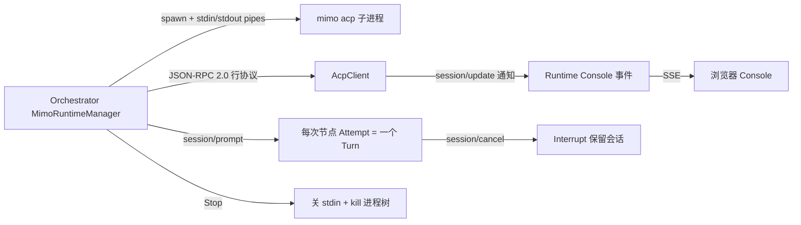

# Mimo ACP 保留 Runtime WebSocket 设计

> date: 2026-08-01
> status: 已实现（v1）
> 关联文档：[[MULTI_AGENT_README]]、[[Reasonix Orchestrator Loop 与多执行器功能说明]]

## 摘要

Codex 已通过 `codex app-server --listen ws://...` 获得保留 Runtime + Runtime Console（JSON-RPC over WebSocket）。Mimo 之前只有 `mimo serve`（HTTP）+ `mimo run --attach`（一次性客户端），没有任何 WebSocket/保留会话设计。本设计让 Mimo 获得与 Codex 对等的**保留 Runtime + Turn 生命周期 + Runtime Console**，传输采用标准 **ACP（Agent Client Protocol）JSON-RPC over stdio**（mimo v0.1.9 实测唯一可用传输；ACP 的 WebSocket/Streamable-HTTP 传输作为可插拔扩展保留在文档中）。

## 现状与问题根因

- mimocode 未产出设计的最可能原因：任务未把"设计文档"设为硬性交付物；`mimo serve` 本身无 WS 端点，模型找不到入口或设计成 HTTP；一次性 `mimo run --attach` 在"只调工具未输出文本"时被判空/失败（L-12 同类）；小模型未读到 `internal/executor/codex/app_server.go` 的 WS 模式；Loop 只验收 Reviewer JSON，无"必须落盘设计"的检查点。

## 关键事实（实测，mimo v0.1.9）

| ACP 方法 | 结果 |
|---|---|
| `initialize` | ✅ 返回 `agentCapabilities.loadSession/resume/fork/list` |
| `session/new` `{cwd, mcpServers}` | ✅ 返回 `sessionId` |
| `session/set_config_option` `{sessionId, configId:"model", value:"xiaomi/mimo-v2.5"}` | ✅ 更新模型 |
| `session/set_mode` `{sessionId, modeId:"build"}` | ✅ |
| `session/prompt` `{sessionId, prompt:[{type:"text",text}]}` | ✅ 流式 `session/update`（`agent_thought_chunk` / `agent_message_chunk` / `usage_update`）+ result `{stopReason, usage}` |
| `session/cancel`（notification） | ✅ 中止当前 turn，保留会话 |
| `session/close` | ❌ `-32601 Method not found`（Close 只能关管道/杀进程） |
| `session/request_permission`（agent→client） | ✅ 客户端必须应答（allow/reject），否则 agent 挂起 |

- 当前构建**没有 ACP-WebSocket 端点**（扫描 `/`、`/acp`、`/ws` 等均为 503/HTTP）；`mimo acp --port` 同时起内部 HTTP/SSE 服务。
- `mimo acp` 进程在 **stdin 关闭时立即退出**（exit 0），因此必须保持 stdin 管道打开直至 Stop。
- `--no-auth` 与 `mimo acp` 组合会报错退出，不能使用。

## 架构

边界：浏览器只访问 Orchestrator 的 HTTP/SSE；`AcpClient` 的 `io.Reader/io.Writer` 抽象允许未来无缝换成 ACP WebSocket/Streamable-HTTP 传输。

## 关键变更

### 1. `internal/executor/mimo`（新包）

- `AcpClient`：持有管道，JSON-RPC 2.0 行协议；`Initialize / NewSession / LoadSession / SetConfigOption / SetMode / Prompt / Cancel / Close`；`completed-before-wait` 竞态保护；`onEvent` 透传 `session/update`；按 messageId 累积 `agent_message_chunk` 文本（`agent_thought_chunk` 不进入最终文本）；`session/request_permission` 按 `PermissionPolicy` 自动应答。

### 2. `internal/orchestrator/mimo_runtime.go`（新）

- `MimoRuntimeManager.ensure`：spawn `mimo acp --port 
 --hostname 127.0.0.1 [--cwd <ws>]`，保持 stdin；轮询 `initialize` 直至就绪（60s）。
- 复用键不变：`nodeID + model + workspace + agent`。
- `RuntimeState.AccessMode = "runtime_console"`（替代旧 `local_history`）；`ThreadID = sessionID`、`TurnID = turnID` 复用现有 Console 字段。
- `prepareSession`：`fresh/fresh_per_run` → 新会话；否则优先 `session/load` 恢复持久化 `ExternalSessionID`，失败回退新会话。
- 状态机：`busy → idle`；Interrupt（`session/cancel`）→ idle 且保留会话；Stop → 关 stdin + kill 进程树；重启恢复沿用 Codex 模式（历史 runtime 标 stopped、保留 sessionID）。
- 权限：`approvalMode=auto/yolo → allow_always`；`ask → reject`。

### 3. `MimoExecutor.Execute`

- `mode=run` 完全不变（`mimo run`）。
- `mode=serve` → `mimoRuntimeMgr.Execute`（一次 Attempt = 一个 ACP Turn）。

### 4. Serve API / 前端

- `GET /runtimes/{id}/console`、`POST /runtimes/{id}/message`、`POST /runtimes/{id}/interrupt` 同时支持 Mimo 与 Codex。
- 前端 Console 已按 `accessMode=runtime_console` 泛化，无需改动；人工 Turn 标记 `orchestrator/manual_turn`，不写 Run/Iteration。

## 测试

- 单测：`internal/executor/mimo`（握手、文本累积、completed-before-wait、错误、断连 fail-pending、权限策略、并发 Prompt 拒绝）；`internal/orchestrator/mimo_runtime_test.go`（事件→SSE、状态保留、reserveTurn、Interrupt 保留会话、权限映射）。
- E2E（真实 mimo）：`TestMimoServeReturnsVisibleTextEndToEnd`（serve→ACP 冒烟）；`TestMimoAcpServeFixedLoopAndManualTurnEndToEnd`（`RUN_INTEGRATION=1`：fixed=2 Loop → `fixed_limit` + 2 轮 + Console 人工 Turn 返回可见文本）。

## 假设与边界

- ACP 传输=stdio（实测）；WebSocket/Streamable-HTTP 为文档化扩展，不启用。
- `session/close` 未实现 → Stop 依赖关 stdin + `killProcessTree`。
- 只迁移 serve 模式；run 模式零改动。
- 浏览器永远不直连 provider 端点。

## Runtime Console 体验（v1.1 补充）

- **流式增量合并**：Codex `item/*/textDelta` / `item/*/delta` 与 Mimo `agent_*_chunk` 按消息合并成一个控制台块（后端 `consoleStreamCoalescer`），在完成/工具调用等边界事件或静默 400ms 时落一条事件；推理文本标记 `category=reasoning` 浅色显示，助手文本 `category=assistant` 高亮。
- **每 Runtime 独立窗口**：控制台改为多实例——Mimo 与 Codex 可同时各开一个窗口，各自轮询/发送/中断，互不覆盖；历史事件仍在各 Runtime 独立保留（上限 300 条合并事件）。
